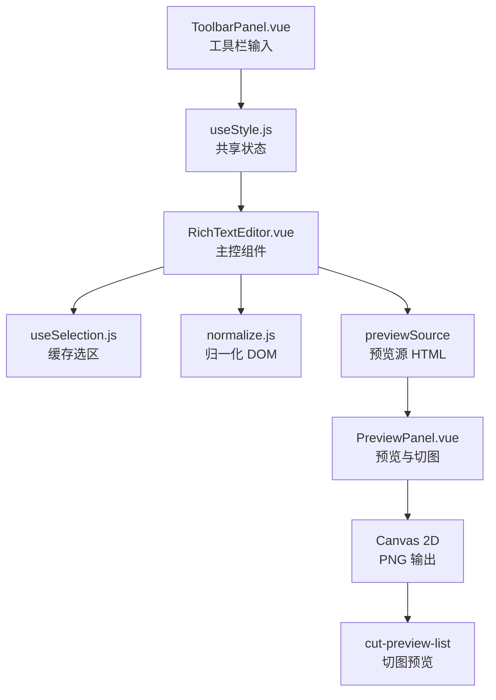

# Vue3 Minimal Editor

一个基于 `Vue 3 + Vite` 的文本编辑、实时预览、分页播放与 PNG 切图工具。

这个项目不是通用型富文本编辑器，而是一个“排版可控、预览可控、切图可控”的前端文本引擎。它直接建立在浏览器原生能力之上：`contenteditable`、`Range`、`Selection`、DOM 归一化、Canvas 渲染，不依赖 Quill、Slate、Tiptap 等第三方编辑器框架。

项目当前关注的核心目标有 4 个：

1. 选区稳定：工具栏操作不应打断文本选中，也不应因为输入数值而丢失选区。
2. 结构稳定：编辑区 DOM 必须尽量保持简单、可预测，避免重复嵌套和样式碎片化。
3. 预览稳定：预览区应当尽量复用编辑区的同源内容和同源盒模型。
4. 导出稳定：切图不依赖 `foreignObject`，避免 canvas 被污染导致 PNG 导出失败。

## 项目能力

当前实现的能力包括：

1. 在 `contenteditable` 编辑区中选择文本，并立即应用工具栏样式。
2. 支持字体、字号、文字颜色、背景色、粗体、斜体、下划线。
3. 支持字间距、行高、描边颜色、描边宽度、描边位置。
4. 支持文本水平对齐、垂直对齐。
5. 支持编辑区宽度、高度、四向内边距设置。
6. 支持多行预览和单行预览两种模式。
7. 多行模式支持静态翻页和方向翻页动画。
8. 单行模式支持静态、左移、右移、无缝循环。
9. 支持按预览结果生成 PNG，并在页面下方查看切图预览。
10. 支持自定义编辑区悬浮滚动条，鼠标移入时显示，且不挤压内容。

## 技术栈

| 类别 | 说明 |
| --- | --- |
| 框架 | `Vue 3.5.x` |
| 构建工具 | `Vite 6.x` |
| 语言 | JavaScript |
| 样式 | 原生 CSS |
| 编辑能力 | `contenteditable` + `Range` + `Selection` |
| 渲染能力 | DOM 渲染 + Canvas 2D |
| 导出能力 | `canvas.toDataURL('image/png')` |

## 运行方式

```bash
npm install
npm run dev
```

生产构建：

```bash
npm run build
```

本地预览构建结果：

```bash
npm run preview
```

## 目录结构

```text
Vue3-Minimal-Editor
├─ public/
│  ├─ favicon.svg
│  └─ icons.svg
├─ src/
│  ├─ assets/
│  │  ├─ hero.png
│  │  ├─ vite.svg
│  │  └─ vue.svg
│  ├─ components/
│  │  ├─ HelloWorld.vue
│  │  ├─ PreviewPanel.vue
│  │  ├─ RichTextEditor.vue
│  │  └─ ToolbarPanel.vue
│  ├─ composables/
│  │  ├─ useSelection.js
│  │  └─ useStyle.js
│  ├─ utils/
│  │  └─ normalize.js
│  ├─ App.vue
│  ├─ main.js
│  └─ style.css
├─ index.html
├─ package.json
├─ vite.config.js
└─ README.md
```

### 目录职责说明

| 路径 | 职责 |
| --- | --- |
| `src/main.js` | 应用入口，加载全局样式并挂载根组件。 |
| `src/App.vue` | 根组件，只承载主编辑器。 |
| `src/style.css` | 全局视觉基线和全局控件样式。 |
| `src/components/RichTextEditor.vue` | 编辑主控组件，连接工具栏、编辑区、预览区。 |
| `src/components/ToolbarPanel.vue` | 工具栏 UI，负责修改共享状态。 |
| `src/components/PreviewPanel.vue` | 多行/单行预览、分页动画、PNG 切图。 |
| `src/composables/useSelection.js` | 选区缓存与恢复。 |
| `src/composables/useStyle.js` | 全局样式状态、默认值、样式转换工具。 |
| `src/utils/normalize.js` | 编辑区 DOM 归一化，减少冗余 `span`。 |
| `src/components/HelloWorld.vue` | Vite 默认示例组件，当前主流程未使用。 |
| `public/icons.svg` | 默认示例组件图标资源。 |

## 架构总览



从架构上看，这个项目可以拆成 3 层：

1. 状态层：`useStyle.js`、`useSelection.js`
2. 编辑层：`RichTextEditor.vue`
3. 输出层：`PreviewPanel.vue`

### 架构思路

1. 工具栏不直接操作 DOM，只改共享状态。
2. 只有主编辑器组件有权把状态真正应用到选中文本上。
3. 只有预览组件有权解释“如何分页、如何动画、如何切图”。
4. 编辑区、预览区、切图区通过“同一份源 HTML + 同一组盒模型参数”建立联系。

这套分层的好处是：

1. 编辑逻辑、预览逻辑、切图逻辑不会混在一个组件里。
2. 状态变更入口统一，便于调试。
3. 后续新增样式项时，只需要按固定路径扩展。

## 核心设计原则

### 1. 只使用浏览器原生编辑能力

项目不依赖第三方编辑器框架，而是直接使用：

1. `contenteditable`
2. `window.getSelection()`
3. `Range`
4. `document.createRange()`
5. DOM 节点增删改

这样做的原因是：

1. 这个项目更关注“受控排版”和“导出结果”，而不是通用富文本能力。
2. 原生 DOM 更容易和 Canvas 切图逻辑建立直接映射。
3. 包体更小，结构更透明。

### 2. 编辑区 DOM 必须尽量简单

这个项目默认把“样式容器”限制在 `span`，换行用 `br`。每次套样式后都会做一次归一化，目的是避免出现如下问题：

1. 相邻同样式 `span` 越积越多
2. 父子 `span` 样式重复
3. 空 `span` 残留
4. DOM 越改越深，后续样式命中越来越不稳定

### 3. 选区与焦点分离

原生浏览器里，一旦点击工具栏输入框，编辑区的原生选区通常会消失。这个项目没有依赖“让编辑器始终保持焦点”这种脆弱做法，而是：

1. 在编辑区交互时缓存一份 `Range`
2. 工具栏修改状态时基于这份缓存 `Range` 改 DOM
3. 在视觉上用 `data-selection-preview` 模拟“仍然选中”

这就是项目里“选区稳定”的核心。

### 4. 预览与切图必须使用同源数据

项目并不是单独维护“编辑区一份内容、预览区一份内容、切图区一份内容”的三套数据，而是：

1. 先从编辑区同步出 `previewSource.html`
2. 多行预览基于这份 HTML 做连续流分页
3. 单行预览基于这份 HTML 做无换行轨道
4. PNG 导出基于这份 HTML 或基于它得到的真实字形数据继续渲染

这样做可以减少“编辑效果对、预览效果错、切图效果又不一样”的概率。

### 5. PNG 导出必须避开 tainted canvas

项目早期最容易踩的坑就是：

1. `SVG foreignObject`
2. 再画到 `canvas`
3. 再执行 `toDataURL`
4. 浏览器报错：`Tainted canvases may not be exported`

当前方案已经改为纯前端 Canvas 绘制文本，不走 `foreignObject` 导出链路，因此能稳定执行：

```js
canvas.toDataURL('image/png')
```

## 状态模型

### 1. `styleState`

定义在 `src/composables/useStyle.js` 中，负责当前选中文本的样式状态。

字段包括：

| 字段 | 含义 |
| --- | --- |
| `fontSize` | 字号 |
| `fontFamily` | 字体 |
| `color` | 文字颜色 |
| `background` | 背景色 |
| `bold` | 粗体 |
| `italic` | 斜体 |
| `underline` | 下划线 |
| `letterSpacing` | 字间距 |
| `lineHeight` | 行高 |
| `strokeColor` | 描边颜色 |
| `strokeWidth` | 描边宽度 |
| `strokePosition` | 描边位置，`inside / center / outside` |
| `textAlign` | 水平对齐 |
| `verticalAlign` | 垂直对齐 |

### 2. `editorBoxState`

控制编辑区盒模型：

| 字段 | 含义 |
| --- | --- |
| `width` | 编辑区宽度 |
| `height` | 编辑区高度 |
| `paddingTop` | 上内边距 |
| `paddingRight` | 右内边距 |
| `paddingBottom` | 下内边距 |
| `paddingLeft` | 左内边距 |

### 3. `previewState`

控制预览和切图：

| 字段 | 含义 |
| --- | --- |
| `format` | `multiline / singleline` |
| `pageTransitionDirection` | 多行翻页方向 |
| `pageTransitionMs` | 多行翻页动画时长 |
| `pageStaySeconds` | 多行页停留时长 |
| `cutImageWidth` | 单行切图宽度 |
| `singleLineMode` | 单行模式 |
| `singleLineSpeed` | 单行速度 |
| `singleLineSeamless` | 是否首尾相接 |

### 4. `savedRange`

定义在 `useSelection.js` 内，是编辑区当前缓存的逻辑选区。

它的意义不是“浏览器此刻真正显示的原生选区”，而是“项目后续对样式应用时应当命中的目标范围”。

### 5. `previewSource`

定义在 `RichTextEditor.vue` 内，负责把编辑区 DOM 同步成：

1. 多行预览使用的 `html`
2. 单行预览使用的 `singleLineHtml`

其中单行版本会把 `<br>` 转成空格占位，避免真正换行。

### 6. `transitionState`

定义在 `PreviewPanel.vue` 内，负责描述多行翻页动画的即时状态：

| 字段 | 含义 |
| --- | --- |
| `active` | 当前是否在翻页 |
| `phase` | `idle / prepare / running` |
| `from` | 起始页 |
| `to` | 目标页 |
| `direction` | 动画方向 |

## 模块详解

### `RichTextEditor.vue`

这是项目的主控组件，也是最关键的编排层。

### 主要职责

1. 渲染工具栏
2. 渲染 `contenteditable` 编辑区
3. 监听用户在编辑区里的输入、选择、滚动
4. 把工具栏状态应用到缓存选区
5. 从当前选区回读样式并回显到工具栏
6. 同步预览源 HTML
7. 触发预览区切图
8. 维护悬浮滚动条显示状态

### 关键方法

| 方法 | 作用 |
| --- | --- |
| `saveSelection()` | 缓存选区，刷新工具栏、预览、滚动状态 |
| `applyStyleToSelection()` | 把 `styleState` 应用到当前缓存选区 |
| `onInput()` | 响应编辑区原生输入后重新归一化和同步 |
| `syncToolbarFromSelection()` | 从选区命中的元素回读样式到工具栏 |
| `patchStyleState()` | 阻断回填时的循环监听 |
| `syncPreviewSource()` | 把编辑区 HTML 同步给预览区 |
| `syncEditorScrollState()` | 更新悬浮滚动条所需的尺寸和偏移 |
| `requestCutImages()` | 调用预览组件暴露的切图方法 |

### 样式应用策略

这个组件处理样式时不是简单地执行 `execCommand`，而是使用更可控的 DOM 操作策略：

1. 如果当前选区完整命中一个现有 `span`
   - 直接修改这个 `span` 的样式
2. 如果当前选区跨越多个节点或只命中部分内容
   - `range.extractContents()`
   - 把片段中的旧 `span` 展开
   - 用新的 `span` 包一层
   - 再插回原位

这样做的原因是：

1. 能显式控制最终 DOM
2. 能避免旧样式残留继续干扰新样式
3. 更容易配合 `normalize()` 收敛结构

### 选区回显策略

工具栏不只是向编辑区“写样式”，还需要从编辑区“读样式”。做法是：

1. 找到选区起点所在元素
2. 优先向上找最近的 `span`
3. 读取 `getComputedStyle`
4. 解析字号、颜色、行高、字间距、字体、粗斜体、下划线
5. 读取描边 `data-*` 元数据
6. 写回 `styleState`

### `ToolbarPanel.vue`

工具栏组件只负责“表达状态”和“修改状态”，不负责编辑区 DOM。

### 它做什么

1. 提供所有样式控件
2. 提供编辑区尺寸和内边距控件
3. 提供预览模式、翻页、单行动画、切图配置控件
4. 提供 `Cut PNG` 按钮

### 它故意不做什么

1. 不直接操作 `contenteditable`
2. 不直接访问选区
3. 不直接调用 DOM API 套样式

这是一条重要规则：工具栏只改状态，主编辑器才改内容。

### `PreviewPanel.vue`

这是项目里逻辑最复杂的组件，负责：

1. 多行分页预览
2. 多行翻页动画
3. 单行滚动预览
4. 单行/多行 PNG 切图
5. Canvas 文本布局与绘制

### 多行预览思路

多行预览不是每页各自重排，而是：

1. 用一份完整 HTML 渲染连续流内容
2. 隐藏测量层得到真实总高度
3. 通过 `页高 = editor height` 计算页数
4. 用 `translateY(-页索引 * 页高)` 的方式截取每一页

好处是：

1. 预览与测量来源一致
2. 分页边界稳定
3. 不需要每页各自重新排版

### 多行翻页动画思路

多行翻页使用双层页栈：

1. `from` 页表示当前页
2. `to` 页表示目标页
3. 静态模式时直接切换页码
4. 动画模式时只让上一页沿指定方向移出
5. 目标页固定承接

动画流程如下：

1. 停留 `pageStaySeconds`
2. 构造 `transitionState`
3. 先进入 `prepare`
4. 使用两层 `requestAnimationFrame`
5. 再进入 `running`
6. 触发 CSS3 `transition`
7. 计时结束后更新 `currentPage`

这样做的关键原因是：浏览器必须先提交“初始位置”，再提交“目标位置”，CSS transition 才会真正触发。

### 单行预览思路

单行模式下：

1. 所有 `<br>` 都会转成空格占位
2. 隐藏测量层负责测出整条文本宽度
3. 文本放进单条轨道 `single-line-track`
4. 根据模式决定是否平移

具体模式如下：

| 模式 | 行为 |
| --- | --- |
| `static` | 不移动 |
| `left` | 向左滚动 |
| `right` | 向右滚动 |

如果开启 `singleLineSeamless`：

1. 会渲染 3 份文本副本
2. 用循环偏移制造首尾相接效果

如果关闭：

1. 文本离开视口后
2. 从另一侧重新进入

### 切图思路

#### 多行切图

多行切图不是直接截图 DOM，而是：

1. 基于隐藏测量层遍历所有文本节点
2. 逐字符提取 `Range.getClientRects()`
3. 获取每个字符的真实位置和真实样式
4. 按页高裁剪字形集合
5. 用 Canvas 重绘成一页一张 PNG

这种做法的优点是：

1. 非常接近浏览器最终版式
2. 不依赖跨源 DOM 截图
3. 可控性高

#### 单行切图

单行切图采用另一条链路：

1. 先把 HTML 拆成 token
2. 用 Canvas 规则自己重建布局
3. 计算整条文本总宽度
4. 按 `cutImageWidth` 分片
5. 每片生成一张 PNG

#### 为什么分两条链路

因为多行和单行的约束完全不同：

1. 多行更强调与浏览器真实排版一致
2. 单行更强调超长宽度、连续切片和固定步长导出

### `useSelection.js`

这是项目“选区稳定”的核心。

### 工作方式

1. 用户在编辑区选择文本
2. `saveRange(root)` 把当前 `Range` 克隆保存
3. 后续即使用户点击工具栏输入框
4. 只要缓存 `Range` 还有效
5. 就仍然可以对原来的选区继续应用样式

### 为什么不用浏览器当前 Selection 直接改

因为当前 Selection 非常容易失效：

1. 点击工具栏会丢焦点
2. 输入数字会改变浏览器选中态
3. 某些输入控件会把 Selection 移到自身内部

所以项目保存的是“逻辑选区”，而不是依赖“浏览器此刻是否还在显示高亮”。

### `useStyle.js`

这是项目的样式状态中心。

### 它解决的问题

1. 默认值集中管理
2. 工具栏与编辑区共享同一份状态
3. DOM 应用样式时统一转换
4. 字体回显需要从浏览器结果反解到预设项
5. 描边位置需要转换成浏览器可理解的具体样式

### 描边实现原理

浏览器原生并没有“内描边 / 居中描边 / 外描边”三套精确文本描边模型，所以项目用了近似方案：

| 业务值 | 实际实现 |
| --- | --- |
| `center` | `-webkit-text-stroke` |
| `inside` | 更细的 `-webkit-text-stroke` 近似 |
| `outside` | 多方向 `text-shadow` 近似 |

这是一条重要现实约束：描边位置是视觉近似，而不是排版引擎级别的严格几何描边。

### `normalize.js`

这是编辑区结构收敛器。

### 解决的问题

每次套样式都会让编辑区 DOM 更复杂，如果不做整理，最终会出现：

1. `<span><span><span>...</span></span></span>`
2. 相邻同样式 `span` 不能自动合并
3. 空节点残留
4. 同一段文本被切成很多碎片

### 当前归一化规则

1. 合并相邻且样式完全相同的 `span`
2. 删除子 `span` 中与父级重复的样式
3. 如果子 `span` 失去独立样式，就直接展开
4. 删除空 `span`
5. 最后执行原生 `root.normalize()`

## 核心交互流程

### 1. 页面初始化流程

1. `main.js` 挂载应用
2. `App.vue` 渲染 `RichTextEditor.vue`
3. `RichTextEditor.vue` 初始化默认状态
4. `onMounted` 同步一次预览源和滚动状态
5. `PreviewPanel.vue` 监听到内容和配置，立即进行分页/测量

### 2. 文本选中并改样式流程

1. 用户在编辑区选择文本
2. `saveSelection()` 触发
3. 当前 `Range` 被缓存
4. 工具栏回显当前样式
5. 用户在工具栏修改任意控件
6. `styleState` 发生变化
7. `watch(styleState)` 触发 `applyStyleToSelection()`
8. 主编辑器把样式写回目标 `span` 或新包裹节点
9. 执行 `normalize()`
10. 重新同步工具栏、预览、滚动状态

### 3. 编辑区直接输入流程

1. 用户直接输入文字
2. `@input="onInput"`
3. 下一帧执行 `normalize()`
4. 重新缓存选区
5. 重新同步工具栏
6. 重新同步预览 HTML

### 4. 多行自动翻页流程

1. 预览配置为 `multiline`
2. 隐藏测量层计算出总页数
3. 如果页数大于 1，则启动自动翻页计时器
4. 到达 `pageStaySeconds` 后调用 `goToPage(nextPage)`
5. 如果方向是 `static`
   - 直接切页
6. 如果方向不是 `static`
   - 构建双页层
   - 触发 CSS 动画
   - 结束后进入下一轮停留

### 5. 单行滚动流程

1. 预览配置为 `singleline`
2. 隐藏测量层测出完整宽度
3. `requestAnimationFrame` 循环更新 `singleOffset`
4. 根据是否无缝循环选择不同偏移策略
5. `singleTrackStyle` 实时反映到轨道 `transform`

### 6. PNG 导出流程

1. 点击工具栏 `Cut PNG`
2. `ToolbarPanel` 发出 `cut-images`
3. `RichTextEditor` 调用 `previewPanelRef.generateCutImages()`
4. `PreviewPanel` 根据当前模式选择切图方案
5. 生成 `data:image/png;base64,...`
6. 渲染到 `cut-preview-list`

## 参数规则与约束

### 文本样式相关

| 项目 | 当前规则 |
| --- | --- |
| 字体 | 固定 10 组常见字体预设 |
| 字号 | 当前工具栏预设为 `16 / 20 / 24 / 28 / 32 / 40 / 48` |
| 字间距 | 输入框范围 `-10 ~ 30` |
| 行高 | 滑杆范围 `1.0 ~ 3.0`，保留 1 位小数 |
| 描边宽度 | 输入框范围 `0 ~ 12` |

### 编辑区盒模型相关

| 项目 | 当前规则 |
| --- | --- |
| 宽度 | 最小 `120px` |
| 高度 | 最小 `120px` |
| 四向 padding | 最小 `0px` |

### 多行预览相关

| 项目 | 当前规则 |
| --- | --- |
| 页模式 | `static / left / right / up / down` |
| 翻页时长 | `100 / 200 / 300 / 400 / 500 / 700 / 1000 / 2000 ms` |
| 停留时长 | `1 ~ 9999 s` |
| 页数上限 | `10 页` |
| 超过上限 | 后续页不进入预览结果 |

### 单行预览相关

| 项目 | 当前规则 |
| --- | --- |
| 模式 | `static / left / right` |
| 速度 | `1 ~ 9 px/frame` |
| 总宽度上限 | `65536px` |
| 单张切片宽度 | 上限 `65536px` |
| 切片粒度 | 每 `8096px` 一片 |

## 当前实现中的“规则”

如果要继续维护或扩展这个项目，下面这些规则最好不要破坏：

1. 工具栏组件不能直接去操作编辑区 DOM。
2. 新增样式项时，必须同时考虑“应用、回显、预览、切图”四条链路。
3. 对编辑区 DOM 的任何结构改动，都应该在结尾走一次 `normalize()`。
4. 描边位置这种浏览器原生不支持的业务语义，必须通过额外元数据保存。
5. 切图实现不要回退到 `foreignObject -> canvas` 路线。
6. 多行分页的判断必须基于同源内容和同源盒模型，不要拆成两套不同排版逻辑。
7. 单行模式的宽度和速度必须做数值钳制，否则极端值会把渲染和导出拖垮。

## 为什么当前实现这样设计

### 1. 为什么不用 `document.execCommand`

因为它的问题很多：

1. 可控性差
2. 结构不可预测
3. 不利于后续归一化
4. 很难和 PNG 导出逻辑对齐

### 2. 为什么工具栏修改后立即生效

因为用户需求不是“填表后点应用”，而是“像排版面板一样改一个值就看到结果”。

这要求：

1. 样式状态必须是共享响应式状态
2. 编辑器必须监听状态变化并即时应用
3. 同时还要避免工具栏回显导致循环触发

所以才有 `isSyncingToolbar` 这类阻断回路的状态。

### 3. 为什么要模拟选中高亮

因为浏览器真实选区在工具栏交互时通常会消失。

如果不补这层视觉反馈，用户会误以为：

1. 选区丢了
2. 样式没命中
3. 当前修改对象不明确

所以项目用 `data-selection-preview` 给当前目标 `span` 补一层视觉高亮。

### 4. 为什么多行和单行切图算法不同

因为二者的问题本质不同：

1. 多行要忠实复现浏览器最终换行结果
2. 单行要在超长文本上可预测地切片

如果强行统一成一种算法，反而会两边都不稳定。

## 扩展指南

### 场景 1：新增一个文本样式属性

建议按以下顺序扩展：

1. 在 `useStyle.js` 给默认状态加字段
2. 在 `ToolbarPanel.vue` 增加控件
3. 在 `styleToCss()` 里转换成 DOM 样式
4. 在 `RichTextEditor.vue` 的 `syncToolbarFromSelection()` 中增加回读逻辑
5. 如果该样式影响切图
   - 在 `PreviewPanel.vue` 的样式解析和 Canvas 绘制中补齐
6. 最后检查 `normalize()` 是否需要调整

### 场景 2：新增一种预览模式

建议按以下顺序扩展：

1. 在 `previewState` 新增模式枚举
2. 在 `ToolbarPanel.vue` 暴露配置项
3. 在 `PreviewPanel.vue` 增加分支渲染
4. 决定该模式的切图算法
5. 明确该模式是否参与自动播放

### 场景 3：新增导出格式

如果要导出 JPEG、WebP、JSON 布局描述等，可以沿用当前结构：

1. 保留 `generateCutImages()` 作为统一导出入口
2. 在内部按格式分流
3. 不要破坏现有 `buildMultilineCutImages()` / `buildSingleLineCutImages()` 的职责边界

## 已知限制与取舍

当前实现仍然有一些明确的边界：

1. 编辑区仍然是轻量文本编辑器，不支持复杂富文本结构，例如表格、图片、列表、嵌套块级节点。
2. 描边位置是近似实现，不是专业图形引擎级别的真实几何描边。
3. 多行分页页数最多 10 页，这是当前产品规则，不是技术极限。
4. 单行切图最大宽度限制为 `65536px`，这是为了控制内存和浏览器画布能力。
5. 项目目前没有撤销/重做历史栈。
6. 项目目前没有持久化存储，刷新页面后状态不会保留。
7. `HelloWorld.vue` 及部分模板资源属于示例遗留文件，不在主功能路径上。

## 开发与调试建议

1. 如果样式看起来“没有生效”，先检查当前缓存选区是否仍然有效。
2. 如果发现编辑区 DOM 越来越复杂，先确认相关逻辑是否遗漏了 `normalize()`。
3. 如果新增样式后编辑区有效、预览无效，通常是 `PreviewPanel.vue` 的样式解析链路没补齐。
4. 如果预览有效、切图无效，通常是 Canvas 绘制链路没补齐。
5. 如果导出图片出现错位，先检查测量来源是否和预览来源仍然同源。

## 当前项目的一句话总结

这是一个以“原生 DOM 可控编辑 + 同源预览 + 纯 Canvas 切图”为核心思想的 Vue 前端文本排版工具。

它的关键不在于功能项数量，而在于下面这条主线始终成立：

`工具栏状态 -> 缓存选区 -> 受控 DOM -> 统一预览源 -> 分页/滚动预览 -> Canvas 切图`

只要后续维护继续遵守这条主线，项目会比较容易扩展，也比较不容易失控。
